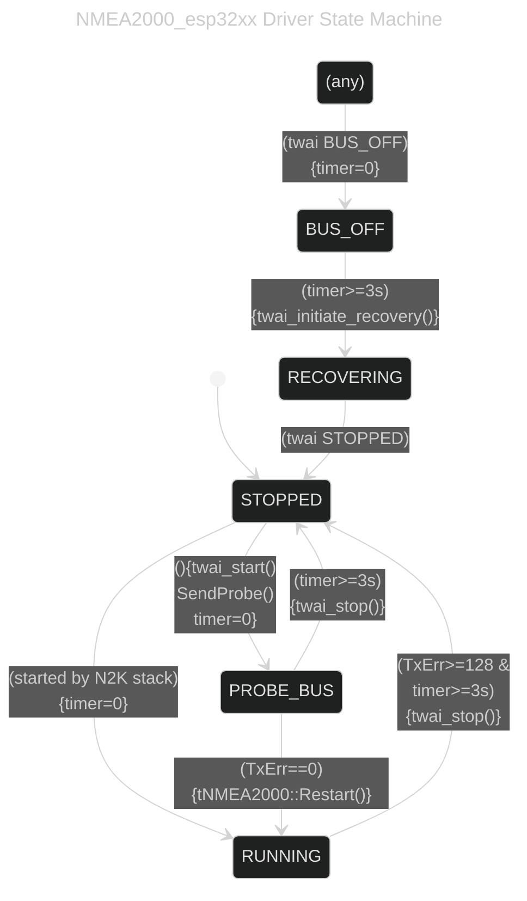

# NMEA2000_esp32_autorestart

| Supported Targets | ESP32 | ESP32-C2 | ESP32-C3 | ESP32-S2 | ESP32-S3 |
|------------------|-------|----------|----------|----------|----------|
| ESP-IDF 4.x      | Yes   | ?        | ?        | ?        | ?        |
| ESP-IDF 5.x      | Yes   | ?        | YES      | ?        | ?        |

CAN Driver component for the [NMEA2000](https://github.com/ttlappalainen/NMEA2000) library for ESP32 targets with auto-restart logic.

## NMEA2000_esp32xx Driver State Machine
This driver contains an error recovery state-machine. It will automatically restart the N2K stack if the cable is disconnected/reconnected or if it reaches an error threshold that results in a BUS_OFF condition.



## Usage

For a working example project using this component see: [NMEA2000_switchbank_example_esp-idf](https://github.com/phatpaul/NMEA2000_switchbank_example_esp-idf)

Some tweaks to sdkconfig that are recommended:

```
CONFIG_TWAI_ERRATA_FIX_BUS_OFF_REC=y
CONFIG_TWAI_ERRATA_FIX_TX_INTR_LOST=y
CONFIG_TWAI_ERRATA_FIX_RX_FRAME_INVALID=y
CONFIG_TWAI_ERRATA_FIX_RX_FIFO_CORRUPT=y
CONFIG_FREERTOS_HZ=1000
```

**NOTE:** CONFIG_TWAI_ERRATA_FIX_TX_INTR_LOST causes crashes! See: https://github.com/espressif/esp-idf/issues/9697

## Changes

* **2023-06-08** - Jaume Clarens "jiauka"
  - First release, WIP, only tested in RX
* **2023-06-09** - Jaume Clarens "jiauka"
  - V0.1 working on both ESP32 and ESP32c3
* **2023-06-10** - Jaume Clarens "jiauka"
  - V0.2 code cleanup
* **2024-03-25** - Paul Abbott "phatpaul"
  - Improved with error handling inspired by wellenvogel - see https://github.com/wellenvogel/esp32-nmea2000/issues/67
* **2025-12-16** - Paul Abbott "phatpaul"
  - Improved with proper CAN bus recovery process. Also bus cable disconnected/reconnected detection and logic to auto restart the NMEA2000 stack.
  - https://github.com/phatpaul/NMEA2000_esp32_autorestart

## License

MIT License

Permission is hereby granted, free of charge, to any person obtaining a copy of
this software and associated documentation files (the "Software"), to deal in
the Software without restriction, including without limitation the rights to use,
copy, modify, merge, publish, distribute, sublicense, and/or sell copies of the
Software, and to permit persons to whom the Software is furnished to do so,
subject to the following conditions:

The above copyright notice and this permission notice shall be included in all
copies or substantial portions of the Software.

THE SOFTWARE IS PROVIDED "AS IS", WITHOUT WARRANTY OF ANY KIND, EXPRESS OR IMPLIED,
INCLUDING BUT NOT LIMITED TO THE WARRANTIES OF MERCHANTABILITY, FITNESS FOR A
PARTICULAR PURPOSE AND NONINFRINGEMENT. IN NO EVENT SHALL THE AUTHORS OR COPYRIGHT
HOLDERS BE LIABLE FOR ANY CLAIM, DAMAGES OR OTHER LIABILITY, WHETHER IN AN ACTION OF
CONTRACT, TORT OR OTHERWISE, ARISING FROM, OUT OF OR IN CONNECTION WITH THE SOFTWARE
OR THE USE OR OTHER DEALINGS IN THE SOFTWARE.

## Thanks

This is based on the work of:

- Timo Lappalainen "ttlappalainen"
- Jaume Clarens "jiauka"
- Andreas Vogel "wellenvogel"
